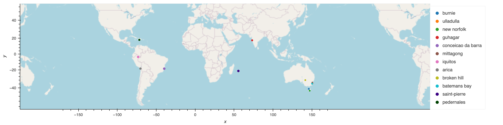

# python-api-challenge
Demonstration of performing data analysis from API source data.

## Background
Data's true power is its ability to definitively answer questions. So, let's take what you've learned about Python requests, APIs, and JSON traversals to answer a fundamental question: "What is the weather like as we approach the equator?"

Now, we know what you may be thinking: “That’s obvious. It gets hotter.” But, if pressed for more information, how would you prove that?

## Weather API Demonstration
Requests to openweathermap.org reveal generalized trends in climate conditions with randomized coordinate data. Statistical analysis was performed and presented to explore relations with latitudinal position and variables, including temperature, humidity, cloudiness, and wind speed.

## Hotel Map (GeoViews Interaction Available in Notebook)
Initially, a script generated random city coordinates and were filtered based on weather conditions acquired by geoapify. API requests to geoapify.com reveal nearby hotel locations based on relative filters and biases for pragmatic applications. The final static image previews the geographic locations of possible vacation cities with ideal weather conditions. Hover interactions reveal more information, including humidity and hotel name. 

